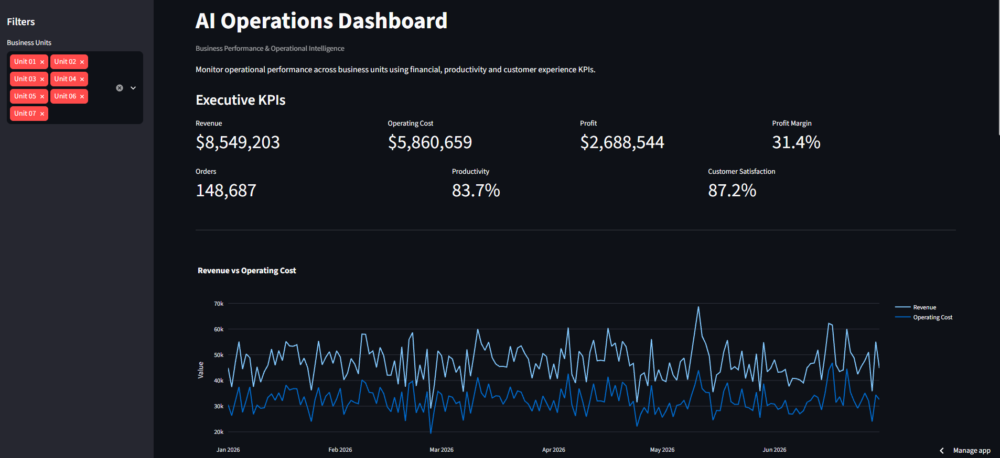

# Hi, I'm César Augusto 👋

Business Operations professional focused on **AI, Automation, Process Improvement, Data and Digital Products**.

I have experience in multi-unit operations, team leadership, KPI monitoring, process optimization and digital product operations. I am currently expanding my technical skills in software development, artificial intelligence, data analysis and automation.

## 🚀 Areas of Interest

- Business Operations
- Artificial Intelligence & Automation
- Process Improvement
- Data Analysis
- Digital Product Operations
- AI-assisted Development
- Marketing Analytics
- Workflow Automation

## 🧠 AI & Digital Tools

- ChatGPT & ChatGPT Work
- Claude Code
- Google Flow
- Google Antigravity
- AI-assisted Development
- Meta Ads
- Landing Page Optimization
- UTM Tracking & Campaign Analytics

## 💻 Currently Learning

- Python
- SQL
- APIs
- AI Agents
- RAG
- System Design
- Automation
- Data Engineering Fundamentals

## ⭐ Featured Projects

### AI Operations Dashboard

AI-powered operations analytics platform combining Business Operations, Data Analytics, KPI monitoring and AI-assisted decision support.

The project simulates an executive operations environment where managers can monitor business performance, identify operational issues and interact with an AI Business Analyst.

**Key Features:**
- Executive KPI monitoring
- Business unit performance comparison
- Revenue, cost and profitability analysis
- Productivity and customer satisfaction metrics
- Automated management attention points
- AI Business Analyst
- AI-assisted operational decision support

**Tech Stack:**
Python · Streamlit · Plotly · OpenAI API · Data Analytics

**Live Demo:**  
https://cesar-ai-operations-dashboard.streamlit.app/

---

### CS2 Tactical Training Tool

Web application designed to help competitive CS2 teams structure strategies, player responsibilities and tactical training workflows.

**Focus Areas:**
- Tactical strategy organization
- Player role management
- Team training workflows
- Competitive preparation

**Tech Stack:**
Web Development · Database Design · Product Development

---

### Marketing Performance Analyzer

Analytics platform focused on digital advertising and marketing performance.

**Key Metrics:**
- ROAS
- CPA
- CTR
- CPC
- Conversion rate
- Campaign performance

**Focus:**  
Turning advertising data into actionable operational insights.

---

### RAG Knowledge Assistant

AI assistant designed to retrieve and answer questions from internal business documents.

**Concepts:**
- Retrieval Augmented Generation (RAG)
- Document retrieval
- AI knowledge systems
- Business information access
- Enterprise automation

## 🛠 Technical Skills

### AI & Automation
- Generative AI
- OpenAI API
- RAG Systems
- AI Agents
- Workflow Automation

### Data & Analytics
- Python
- Data Analysis
- KPI Dashboards
- Business Intelligence
- Process Improvement

### Development
- Python
- Streamlit
- Plotly
- Git & GitHub
- APIs
- Software Development Fundamentals

## 📊 AI Operations Dashboard — Case Study

### Business Problem

Operations teams often need to monitor financial performance, productivity and customer experience across multiple business units.

The goal of this project was to create a centralized analytics environment capable of transforming operational data into management insights.

### Solution

I developed an interactive dashboard that combines operational KPIs, business-unit comparison, automated attention points and an AI Business Analyst.

The AI layer allows managers to ask operational questions using natural language and receive analysis based on the currently selected business data.

### Example Analysis

The system can identify:

- Business units with cost-efficiency issues
- Low productivity indicators
- Customer satisfaction gaps
- Profitability differences
- Areas requiring management attention

### Outcome

The project demonstrates how AI can be integrated into traditional Business Intelligence workflows to support faster operational analysis and decision-making.

**Technologies:** Python · Streamlit · Plotly · OpenAI API

## 🌎 Languages

- Portuguese — Native
- English — Intermediate
- French — Beginner
- Spanish — Basic

## 📫 Connect with me

LinkedIn: linkedin.com/in/cesar-augusto-brito/
